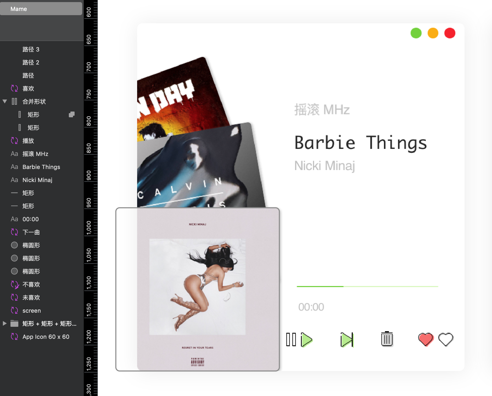
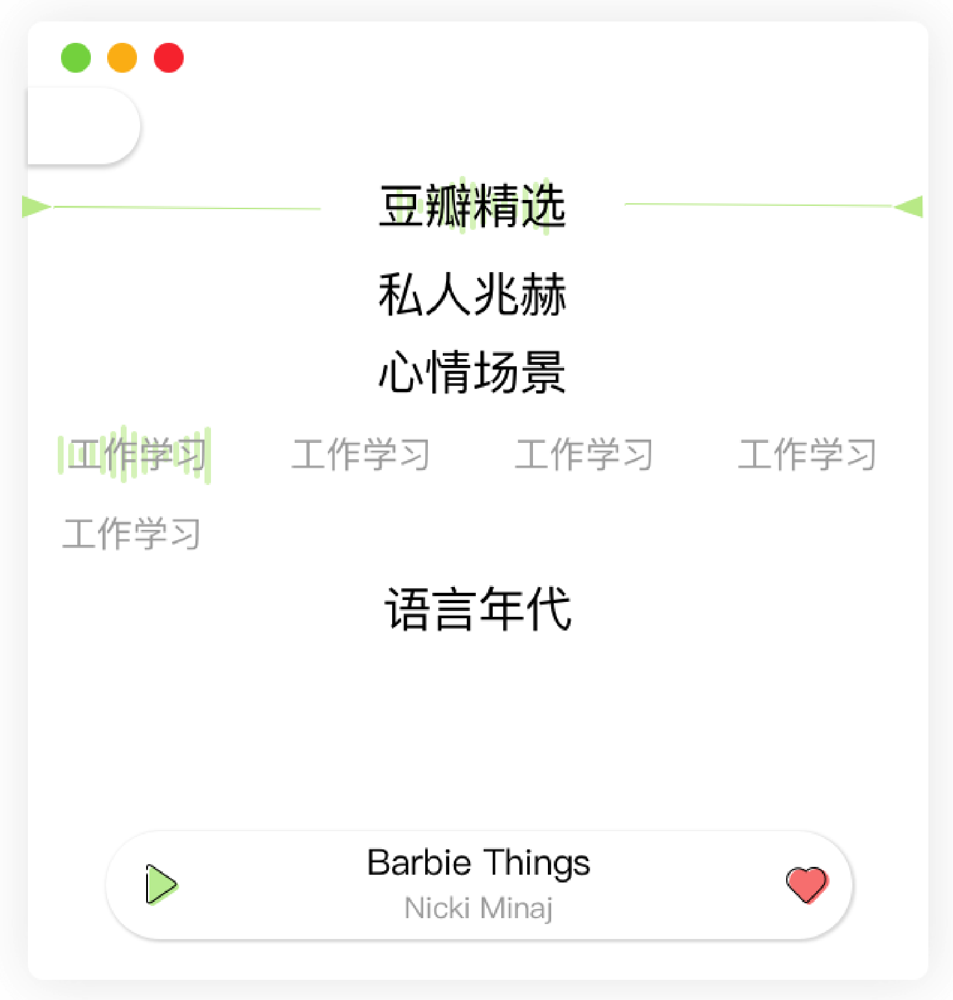

# Mame - 基于Electron和React 16的豆瓣FM6.0客户端

## 简介

~~预计两个月完成，坚持更新💪~~ （我鸽了，但我还会回来的）

👤个人项目

部分UI设计参考豆瓣FM6.0 iOS客户端，icon等其他部分均为自己使用sketch💎进行设计（也是自己第一次使用sketch构建完整项目）

交互及动画没有借助工具，🧠脑内构造😊动手实现

API使用豆瓣FM移动端的接口，自行归档整理，感谢阿北

“Mame”是日语“豆子”的发音😉

## UI&UX设计

首页：音频封面部分的UI和动画参考了豆瓣FM移动端的设计，播控区icon等其他内容为自行设计结果

剩下的还在设计中...

## API

coming soon

## 涉及到的技术及框架

- react v16
- electron
- react hooks
- react-router-dom
- react-spring
- anime.js
- lowdb
- ~~sass~~  styled-components

## TODO

- Mojave 夜间模式支持
- 任务栏快捷键
- 键盘快捷键映射
- 菜单栏
- 频道页 UI 设计

## Questions

- electron 关闭时，renderer 的 window.onbeforeunload ，main 的 will-quit 、before-quit 的先后顺序问题
- renderer 与 main 通信，如何调用在 main 创建的 DB
- 匿名函数被创造时的内部变量，调用时发生变化

<!-- ## 写在后面

想做Mame的原因有很多，一方面是react hook出了蛮久，但在公司用的vue，自己一直找不到练手的项目又不想学别人的二手，就准备自己动手写一个。二是我本身一直对UI设计很感兴趣，就和设计师朋友讨教了一下设计的学习路线，所以Mame也是我的第一个设计作品。再就是我本身肥肠喜欢豆瓣以及豆瓣的产品线，作为占用我使用电量最多的APP，我就打算写一个豆瓣（fm）出来，还有，我真的太喜欢豆瓣FM6.0的UI了❤️ -->

- Q:redux 和 shouldComponentUpdate?
- A:redux 本身不涉及 diff 操作，diff 操作为 react 内部实现， redux 只有一个用途，就是提供 props，而 shouldComponentUpdate 才是 diff 的关键，它会判断该组件的 props 和 state 是否变化， 它的作用是拦截组件渲染，根据 props 和 state 来确认是否要 rerender ，在shouldComponentUpdate 仅浅比较 porps 和 state 时，可以使用 PureComponent 替代。

- 只要 setState 调用，无论修改什么，render 方法就会自动触发，由于 diff 算法的存在，react 想要成功 update 就必须要经过两个步骤。
1）render function 和 2） virtual DOM diff，从而看出，想要优化性能也只有这两个方法。 1）尽量不改变 virtual DOM，2）不触发 render function
